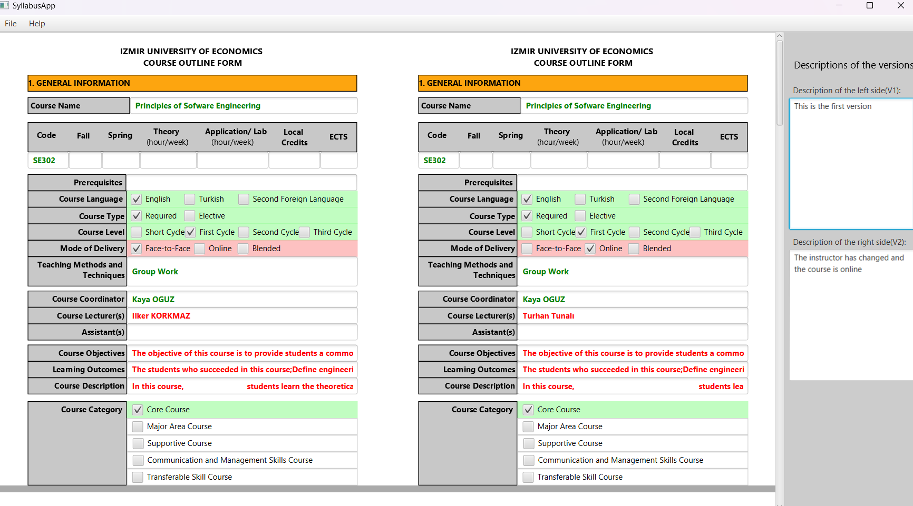
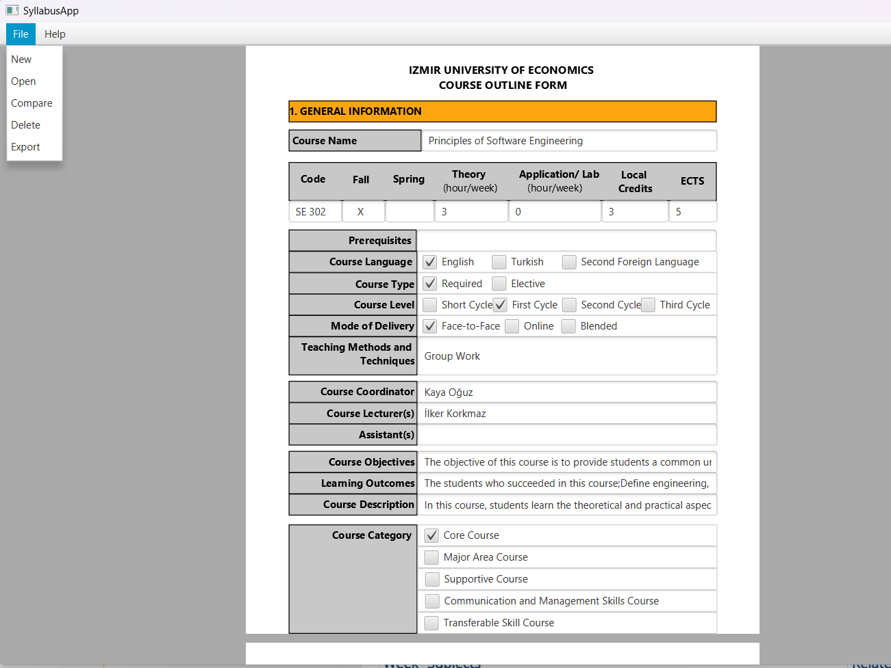
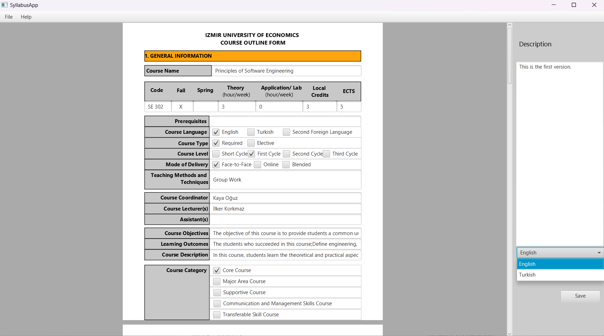
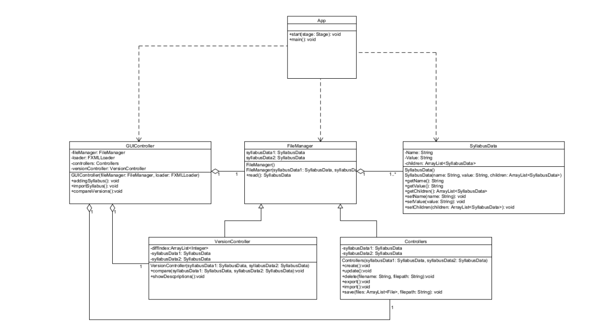

The Syllabus App is a Windows desktop application designed for creating, editing, deleting, comparing, and importing/exporting versions of course syllabi, with a focus on version control. Implemented in Java, the application will be installed on target computers via an installer, eliminating the need for additional programs. Its primary purpose is to streamline the management of course syllabus documents within the university, addressing challenges related to changes and updates by offering efficient data entry, robust version control, and simplified documentation processes.

## Announcements / Notes
- The Syllabus App is targeted for Windows OS. The user is required to only have JRE.

## Libraries Used
- JSON Simple (Not required to include externally)

## Installation
- Download the set up file from the releases of the project's repository. (https://github.com/egedenizz/SE302-syllabusApp/releases)
  
## Design

  

